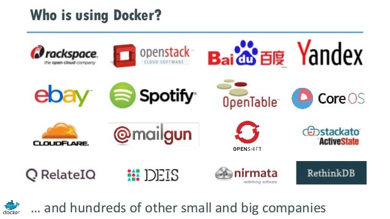
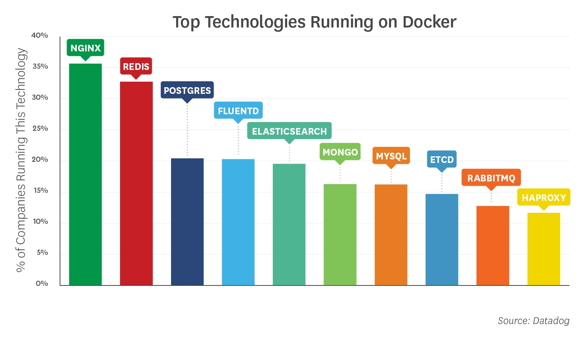
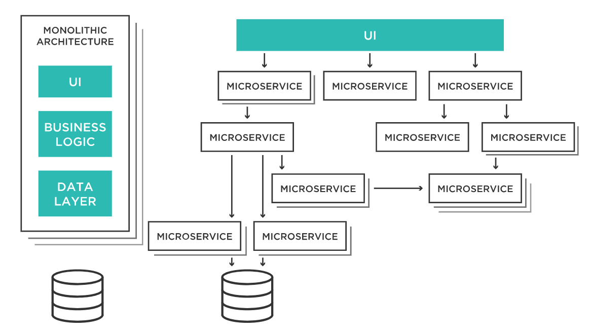

# Docker
## What is Docker?
Docker is an open platform for developing, shipping, and running applications. Docker enables you to separate your applications from your infrastructure so you can deliver software quickly. With Docker, you can manage your infrastructure in the same ways you manage your applications. By taking advantage of Docker’s methodologies for shipping, testing, and deploying code quickly, you can significantly reduce the delay between writing code and running it in production.

## Docker's Advantages over VMs
- Start time
- - Docker containers typically start in a few seconds or less, whereas virtual machines can take minutes. Thus, workloads that need to start very quickly, or that involve spinning apps up and down constantly, may be a good fit for Docker.
- Efficiency
- - Because Docker containers share many of their resources with the host system, they require fewer things to be installed in order to run. Compared to a virtual machine, a container typically takes up less space and consumes less RAM and CPU time. For this reason, you can often fit more applications on a single server using containers than you could by using virtual machines. Likewise, due to their lower levels of resource consumption, containers may help to save money on cloud computing costs.
- Code reuse
- - Each running container is based on a container image, which contains the binaries and libraries that the container requires to run a given application. Container images are easy to build using Dockerfiles. They can be shared and reused using container registries, which are basically repositories that host container images. You can set up an internal registry to share and reuse containers within your company. Thousands of prebuilt images can be downloaded from public registries (e.g. Docker Hub or Quay.io) for free and used as the basis for building your own containerized applications.

## Who uses Docker?

## What is ran on Docker?

## Microservices Architecture
Microservices architecture refers to a technique that gives modern developers a way to design highly scalable, flexible applications by decomposing the application into discrete services that implement specific business functions. These services, often referred to as “loosely coupled,” can then be built, deployed, and scaled independently.

Each service communicates with other services, through standardized application programming interfaces (APIs), enabling the services to be written in different languages or on different technologies. This differs completely from systems built as monolithic structures where services were inextricably interlinked and could only be scaled together.

As each service has a limited functionality, it is much smaller in size and complexity. The term microservice comes from this discrete functionality design, not from its physical size.

## Advantages over Monolithic Architectures
Developers simplify things to lower cognitive load and make their code easier to maintain and support. Modularity is one such simplification. Here are the advantages of using isolated microservices over all-in-one applications.
- Variety of technologies
	- Keeping services small makes them easy to test, since there are limited input variants. The only tricky part – a service may be unavailable due to network issues or another problem. So, if the service is dependent on its output, this possibility should be considered and tested.
- Easier testing of microservices
	- Making and deploying a small code change iterations to the server is much easier with small separate services than with an entire monolithic application. A large monolith may take a while to test, build and deploy. In contrast, with a microservices, this often takes just minutes. Only the changed microservice needs to be re-deployed, and other stable working services stay untouched, making the release process faster and easier.
- Continuous delivery and deployment
- - Making and deploying a small code change iterations to the server is much easier with small separate services than with an entire monolithic application. A large monolith may take a while to test, build and deploy. In contrast, with a microservices, this often takes just minutes. Only the changed microservice needs to be re-deployed, and other stable working services stay untouched, making the release process faster and easier.
- Optimized development process
- - Since microservices are isolated from each other, different teams can work independently on separate services. This reduces communication time between teams. API documentation for microservice interactions is often all a team needs to begin developing a new service. In contrast, for a monolithic application, a new team must understand how a whole app works before adding or modifying a functionality.

## Disadvantages of Microservices
- Easier to debug and test
- - Microservices are much less dependent on each other, and that means there are often many more scenarios where something can go wrong: poor network performance, service is not responding, etc. For monolithic applications, the number of problem scenarios is relatively low.
- Quicker response
- - Monolithic apps don’t require us to suffer from transferring data between multiple services. While this may sound insignificant in 2018, when even cell phones have a super-fast internet connection, as the number of microservices in the application expands, 200-300 ms for receiving a response may grow to several seconds or more. Users may have to wait for all 30 API calls to finish before they see anything on the page. To some degree, this problem can be solved by applying an API gateway pattern or GraphQL, but these tools simply hide these data flow from the user. On the other hand, Monolith transportation costs between modules are negligible, since they are within one application.
- Faster design and development
- - Beginning development of a monolithic system, especially from scratch, is much easier than splitting business processes into independent parts, composing interactions between services, etc. Because microservice architecture has only recently been popularized, it has no commonly agreed standards or tools. Monolithic apps employ a variety of frameworks and tools for different use cases, and they’re ready to go right away. In practice, this makes monolith applications faster to design and develop, especially in the initial prototyping stage.
